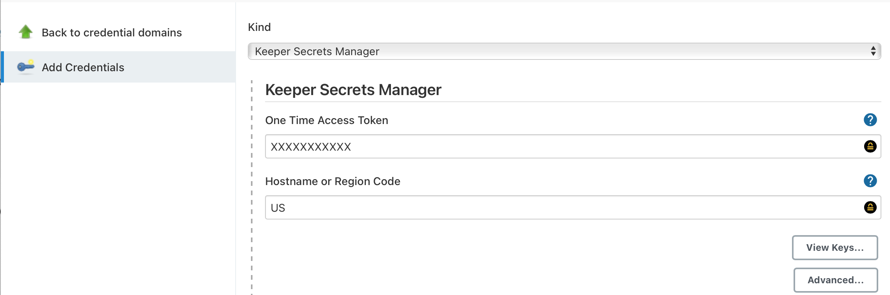
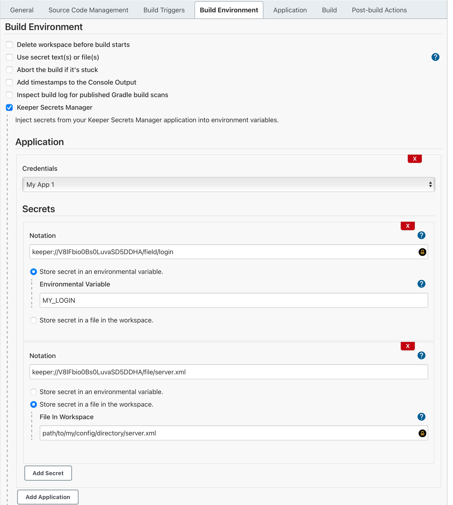
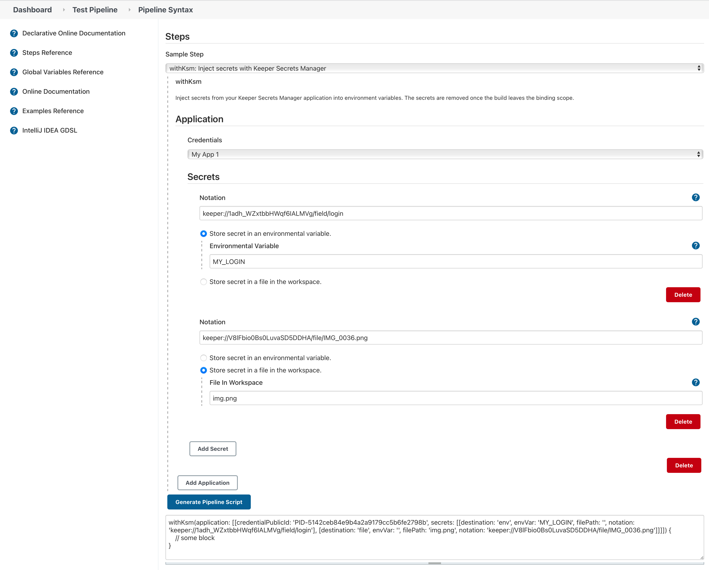
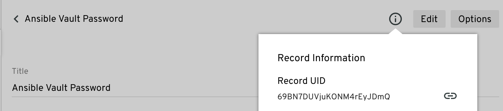

# keeper-secrets-manager

## Introduction

This plugin allows you to retrieve secrets from your [Keeper Secrets Manager](https://www.keepersecurity.com) account and place the values 
them into environmental variables, or files, in the builder and workflow pipeline.

## Getting Started

Additional documentation can be found in the [Keeper Documentation Portral](https://docs.keeper.io/secrets-manager/secrets-manager/integrations/jenkins-plugin).

### Getting Credentials

First, start a Jenkins instance with the keeper-secrets-manager plugin installed. You will either need to install
[Keeper Commander](https://github.com/Keeper-Security/Commander/releases) or use the Keeper Vault to create a
one time access token.

* Get a one time access token via [Keeper Commander](https://docs.keeper.io/secrets-manager/secrets-manager/about/one-time-token#using-commander-to-generate-a-token).
* Get a one time access token via [Keeper Vault](https://docs.keeper.io/secrets-manager/secrets-manager/about/one-time-token#using-the-keeper-vault-to-generate-a-token).

Within Jenkins, navigate to **Manage Jenkins->Manage Credentials->(scope)->Add Credentials**, 
then select **Keeper Secrets Manager** in the **Kind** dropdown.



Cut-n-paste the One Time Access Token into the UI field, set the Description, and save the credential. Upon saving
the plugin will attempt to retrieve the required keys from the Keeper Secrets Manager server and populate them. When
you open the credential again, the One Time Access Token should be blank.

If there was a problem redeeming the One Time Access Token, the error message will appear in the One Time Access Token
field.

You can also validate the credential by clicking **Advanced**, then clicking the **Validate Credential** button. If
there is a problem with the credential and error message will be displayed. If no message appears, the
credential is valid.

### Freestyle Project

The Keeper Secrets Manager is available in a freestyle project as a **Build Environment**. To
enable just check the Keeper Secrets Manager box in the **Build Environment** checkbox group.



Next click the **Add Application** button and select the application credential that contains
your secrets. At this point you can begin to add secrets.

Secrets use [Keeper Notation](#keeper-notation) to describe which
field in a record should be retrieved. The secret value can be stored in an environmental
variable or saved to a file in your workspace.

Select the desired destination radio button and enter the environmental variable or
file name.

The logger will attempt to redact any secrets that are displayed. Any secret files
created the by the plugin will be removed when the build finishes. It is recommended that
any Keeper Notation that uses **file** be stored as a file in the workspace instead
of an environmental variable. Files may contain encoding or special characters that
prevent correctly redacting the secret.

### Pipeline Workflow

Below is an example of a Jenkinsfile using the Keeper Secrets Manager plugin.

```groovy
pipeline {
  agent any 
  stages {
    stage('Hello') {
      steps {
        withKsm(application: [
          [
            credentialsId: 'PID-5142ceb84e9b4a2a9179cc5b6fe2798b',
            secrets: [
              [destination: 'env', envVar: 'MY_LOGIN', filePath: '', notation: 'keeper://1adh_WZxtbbHWqf6IALMVg/field/login'],
              [destination: 'env', envVar: 'MY_SEC_PHONE_NUM', filePath: '', notation: 'keeper://Atu8tVgMxpB-iO4xT-Vu3Q/custom_field/phone[1][number]'],
              [destination: 'file', envVar: '', filePath: 'img.png', notation: 'keeper://V8lFbio0Bs0LuvaSD5DDHA/file/IMG_0036.png']
            ]
          ]  
        ]) {
          sh'''
              # Will be redected in console  
              echo "MY_LOGIN = ${MY_LOGIN}"
              echo "MY_SEC_PHONE_NUM = ${MY_SEC_PHONE_NUM}"

              ./my/build/script --login  "${MY_LOGIN}" --phone "${MY_SEC_PHONE_NUM}"
              ls -l img.png
          '''
        }
      }
    }
  }
}
```

The Keeper Secrets Manager snippet can be created using the **Pipeline Syntax** editor inside of Jenkins. Just select 
**withKsm** from the **Sample Step** dropdown. You can then add an application, which will allow you to select the
credentials and add secrets. You do have the option to add multiple applications, if all your secrets are not in the
same application.

When you are finished setting up your application, credentials, and secrets, you can click the **Generate Pipeline Script**.
That will generate the **withKsm** block. This snippet can then be added to your Jenkinsfile.



The environmental variables containing the secrets are only accessible within the withKsm block where they are defined. 
Once you exit the block the secrets will be removed.

## Keeper Notation

You can optionally install the [Keeper Secrets Manager CLI](https://docs.keeper.io/secrets-manager/secrets-manager/secrets-manager-command-line-interface)
to view records and their fields to help build notation.

Keeper Notation is way to describe a field in a record and the parts of the field's value. It looks like the following:

    keeper://Ipk9NR1rCBZXyflWbPwTGA/field/login
    keeper://Ipk9NR1rCBZXyflWbPwTGA/custom_field/Lock Box Location
    keeper://Ipk9NR1rCBZXyflWbPwTGA/file/cat.png
    keeper://Ipk9NR1rCBZXyflWbPwTGA/custom_field/Content Phone[1][number]

Notation can be broken into three pieces: the Record UID, the type of field in the record, and 
the field label, type or file name and access in to the values.

You can test notation using the Keeper Secrets Manager CLI

```shell
$ ksm secret notation keeper://Ipk9NR1rCBZXyflWbPwTGA/field/login
```
Additional documentation on notation can be found on the [Keeper Documentation Portal](https://docs.keeper.io/secrets-manager/secrets-manager/about/keeper-notation).

### The Record UID

Each record has a unique identifier which is obtainable from multiple tools.

In the Keeper Vault, clicking the Info icon will show the Record UID. You can copy to clipboard a URL
that contains the Record UID.



In Commander, you can see the Record UID by issuing the _list_ command. 

    My Vault> list
      #  Record UID              Type       Title             ...
    ---  ----------------------  ---------  ----------------  ...
      1  Ipk9NR1rCBZXyflWbPwTGA  login      Web 1    
      2  6vV5bvyu5eLygHa3kMEWug  login      Web 2 
      3  Eq8KFpJkRkgOnpXjNIjYcA  login      Prod Database

In the Keeper Secrets Manager CLI, you can see the Record UID by running the command below.

```shell
$ ksm secret list
UID                     Record Type          Title
----------------------- -------------------- -----------------
A_7YpGBUgRTeDEQLhVRo0Q  file                 Tomcat Certs
Atu8tVgMxpB-iO4xT-Vu3Q  login                Router Login
A_7YpGBUgRTeDEQLhVRo0Q  file                 Company Logos
```

### The Field Type

There are three field types: **field**, **custom_field**, and **file**.
 
* **field** - Refers to the standard field you get for the record type. These are the
fields that appear at the top of the record, in Keeper Vault, like **Login** and **Password**. They are part of the record type.
* **custom_field** - Refers to field added in the Custom Field section. There are fields you add to the record.
* **file** - Refers to the Files and Photo section.

### Field Label or File Name

For the **field** and **custom_field** field types, this would be the label shown in the Keeper Vault. In Keeper Commander you can get
the details of the record using the "get &lt;RECORD UID&gt;" command, and via the CLI with 
**ksm secret get -u &lt;RECORD UID&gt;**.

    keeper://Atu8tVgMxpB-iO4xT-Vu3Q/field/login
    keeper://Atu8tVgMxpB-iO4xT-Vu3Q/field/password
    keeper://Atu8tVgMxpB-iO4xT-Vu3Q/custom_field/My Pad Lock Number

For the **file** field type, use the name of the file.

    keeper://A_7YpGBUgRTeDEQLhVRo0Q/file/server.xml

Only the Keeper Secrets Manager CLI will give a more detail view of the values in the record. For example, if you look
at a bank card record type you can see the **paymentCard** is more complex than just a literal value. It's actually
a dictionary of values.

```shell
    $  ksm secret get -u jW8FGAqf02Rlm-N1dr4vkA
    Record: jW8FGAqf02Rlm-N1dr4vkA
    Title: Payment Card Record
    Record Type: bankCard

    Field        Value
    ------------ --------------------------------------------------------------------
    paymentCard  [{"cardNumber": "5555555555555555", "cardExpirationDate": "01/2021", 
                 "cardSecurityCode": "543"}]
    text         Cardholder
    pinCode      ****
    addressRef   s73hd3L4cruuDc0iksdkxw

    Custom Field Type     Value
    ------------ -------- --------------
    Pin Code     pinCode  ****
```

To get the credit card number, the notation would look like this:

    keeper://jW8FGAqf02Rlm-N1dr4vkA/field/paymentCard[cardNumber]

## Issues

Report issues and enhancements in the [Keeper Secrets Manager issue tracker](https://github.com/jenkinsci/keeper-secrets-manager-plugin/issues).

## LICENSE

Licensed under MIT, see [LICENSE](LICENSE.md)

